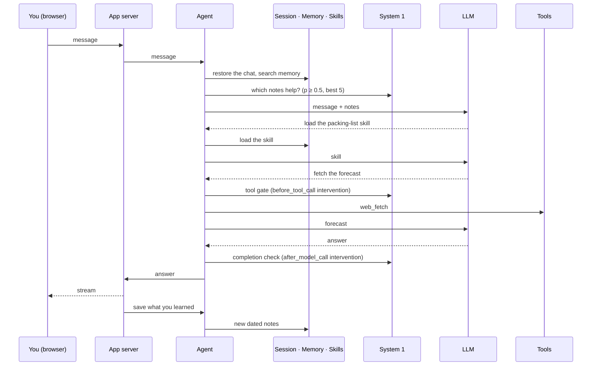
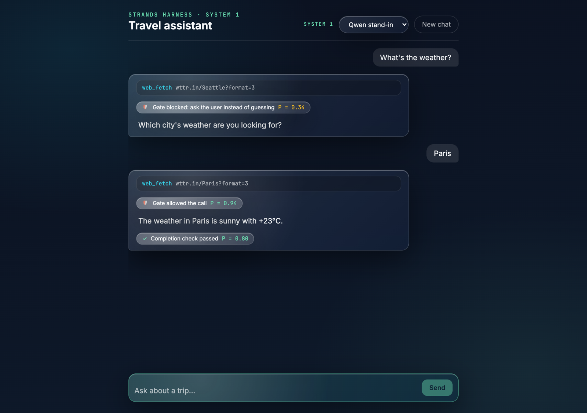
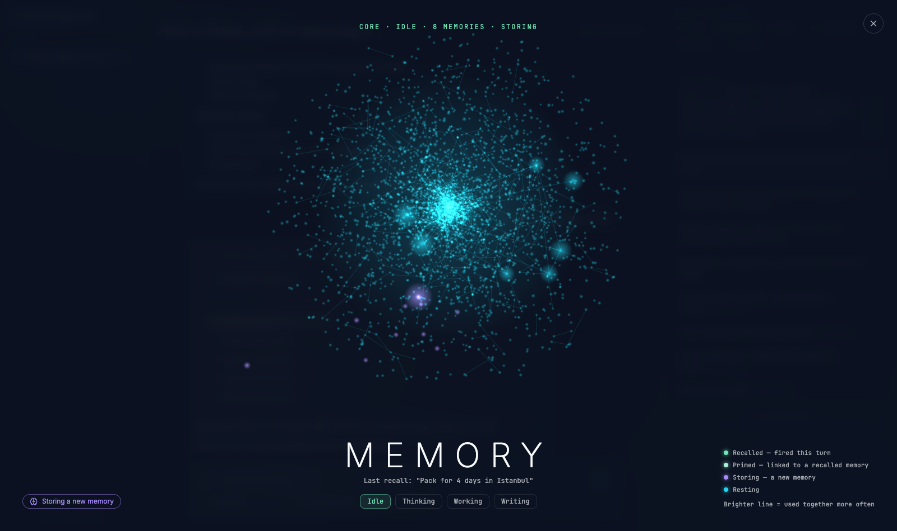
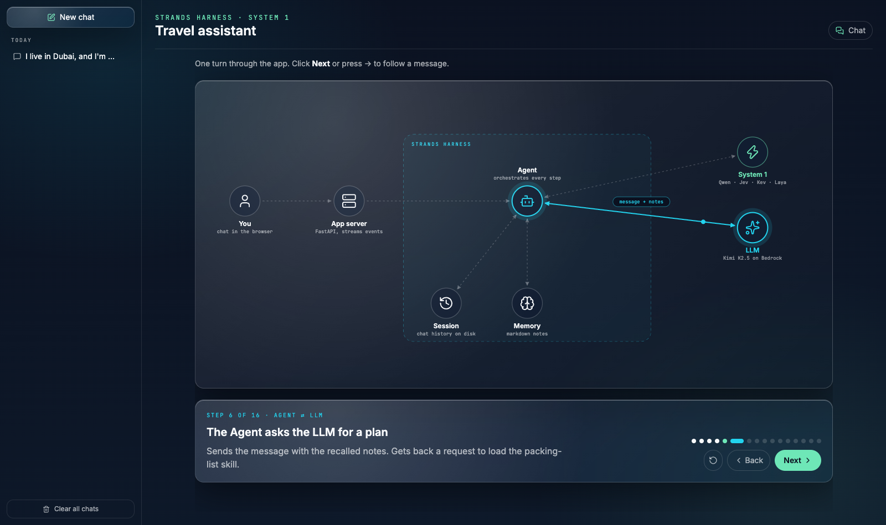

# Strands Harness Labs

Hands-on labs for the open-source [Strands harness](https://strandsagents.com/docs/user-guide/harness/)
(`pip install strands-harness`, `create_harness`)
and the **System 1** pattern. You build one travel assistant, one idea per lab: the harness
basics first, then a fast classifier that watches the agent and lets plain Python decide.
By lab 9 the assistant looks up the forecast, remembers where you live, writes a packing
list, asks before saving it, blocks guessed tool calls, finishes what it started, and uses
the expensive model only when the request needs it.

## 🚀 Quick Start

### Prerequisites

- [uv](https://docs.astral.sh/uv/getting-started/installation/)
- [Ollama](https://ollama.com) (for the System 1 classifier, labs 6–10)
- AWS credentials with Amazon Bedrock access (for the main agent, by default)

### Installation

```bash
uv sync
cp .env.example .env
ollama pull qwen3.5:4b
```

### Choosing the main model

The agent runs on **Kimi K2.5 on Bedrock** by default ($0.60 / $3.00 per million tokens).
Swap it with one line in `.env`:

```bash
MAIN_MODEL=bedrock/moonshotai.kimi-k2.5          # default
MAIN_MODEL=bedrock/nvidia.nemotron-super-3-120b  # cheapest
MAIN_MODEL=bedrock/us.anthropic.claude-sonnet-5  # Claude
MAIN_MODEL=bedrock/us.moonshotai.kimi-k3         # latest Kimi
MAIN_MODEL=ollama/gpt-oss:20b                    # free and fully local (ollama pull gpt-oss:20b)
```

Lab 9 routes between `SMALL_MODEL` and `BIG_MODEL` (Kimi K2.5 and Kimi K3 on Bedrock by default); for a
fully local lab 9, set those to `ollama/` models too.

### Choosing the System 1 model

Labs 6–9 use `SYSTEM1_MODEL` as the classifier. Pick one in `.env`:

| `SYSTEM1_MODEL` | What it is | Setup |
|---|---|---|
| `ollama/qwen3.5:4b` (default) | A small local chat model as a **stand-in**: one token + its probabilities | `ollama pull qwen3.5:4b` |
| `jev` | TypeSafe's hosted System 1 model (paid) | `TYPESAFE_API_KEY=...` in `.env` ([typesafe.ai](https://typesafe.ai)) |
| `kev` | [Kev](https://github.com/jaredpalmer/kev), an open Jev-alike on your machine (Kev-4B needs a 32 GB Mac) | `./kev.sh start` (the labs offer to run it) |
| `laya` | [Laya](https://github.com/NandhaKishorM/laya), an open BERT-based System 1 model | `uv sync --extra laya` |
| `laya-travel` | Laya fine-tuned on travel questions by lab 10b | run lab 10b once |

The labs don't change: `yes_no()` and `choice()` in `labs/common/system1.py` send the same questions to
whichever you pick. Lab 10 runs all four side by side (five, once lab 10b has trained Laya).

## 📚 Lab Overview

Each lab is one short file. Lab N adds exactly one idea to lab N-1, so a diff shows the new thing.

### Chat with any lab

Every agent lab (1–5, 7–9) runs a short scripted demo. Add `--chat` to talk to it instead — the
System 1 traces (`gate`, `check`, `router`, each with its bars) print live between turns:

```bash
uv run labs/lab7_tool_call_gate.py --chat
```

### Lab 1: Your First Harness
**File:** `labs/lab1_first_harness.py`
One `create_harness()` call next to a hand-built `Agent`.
**What's new:** `create_harness(model=..., instructions=...)`
**Video:** _coming soon_
**Run:** `uv run labs/lab1_first_harness.py`

### Lab 2: Built-in Tools
**File:** `labs/lab2_builtin_tools.py`
The assistant fetches the real forecast without you writing a tool.
**What's new:** `builtin_tools=["web_fetch", "read", "write"]`
**Video:** _coming soon_
**Run:** `uv run labs/lab2_builtin_tools.py`

### Lab 3: Sessions & Memory
**File:** `labs/lab3_sessions_memory.py`
Tell it where you live once; a new process still knows.
**What's new:** `session={"id": "travel"}`, `memory=True`
**Video:** _coming soon_
**Run:** (`./reset.sh` first, so it doesn't already remember you)
```bash
uv run labs/lab3_sessions_memory.py tell
uv run labs/lab3_sessions_memory.py ask
```

### Lab 4: Skills
**File:** `labs/lab4_skills.py`
A packing-list skill written in markdown (`.agent/skills/packing-list/SKILL.md`), not code.
**What's new:** `skills=True`
**Video:** _coming soon_
**Run:** `uv run labs/lab4_skills.py`

### Lab 5: Interventions
**File:** `labs/lab5_interventions.py`
Approve tool calls in the terminal, then replace the prompts with a plain-English rule.
**What's new:** `interventions=HumanInTheLoop(ask="stdio")`, `resolve_interventions("<policy>")`
**Video:** _coming soon_
**Run:**
```bash
uv run labs/lab5_interventions.py          # approve every call
uv run labs/lab5_interventions.py policy   # a policy decides
```

### Lab 6: System 1 Basics (6a–6e)
A System 1 model answers typed questions — yes/no (`Noul`), pick one (`Choice`), rate (`Score`) — with
probabilities, and plain Python decides. Each lab asks the same questions about four conversations
(a guessed city, Paris, a packing request, a vague trip idea). Each one reads as the same steps (the
conversation, the questions, one call, then plain Python decides), pauses on each conversation until you
press Enter, and draws every probability as a bar. Jev and Kev get all four right; Laya and the Qwen stand-in miss some — lab 10
measures that. The same questions, five ways:

| File | What it shows | Needs |
|---|---|---|
| `labs/lab6a_jev.py` | Jev, TypeSafe's hosted System 1 model, through its Python SDK | `TYPESAFE_API_KEY` in `.env` |
| `labs/lab6b_kev.py` | Kev: same SDK, same questions — only the URL changes | Kev server running (below) |
| `labs/lab6c_laya.py` | Laya: a different open model family, same question shapes | `uv sync --extra laya` |
| `labs/lab6d_qwen_stand_in.py` | No System 1 model? Ask a small chat model for one token and read its probabilities | `ollama pull qwen3.5:4b` |
| `labs/lab6e_standardized.py` | One helper (`yes_no`, `choice`) for all four; switch with `SYSTEM1_MODEL` | any of the above |

**Kev** runs as a local server. The Kev labs offer to start it for you, or start it yourself:
```bash
./kev.sh start    # first time downloads ~9 GB; it then stays running, so later labs don't wait
./kev.sh status
./kev.sh stop
```
Kev-4B needs a 32 GB Mac; on a smaller machine use `KEV_MODEL=jaredpalmer/kev-0.8b ./kev.sh start`.
**Video:** _coming soon_
**Run:** `uv run labs/lab6a_jev.py` (and so on); `SYSTEM1_MODEL=kev uv run labs/lab6e_standardized.py`

### Lab 7: Tool-Call Gate
**File:** `labs/lab7_tool_call_gate.py`
"What's the weather?" with no city: the agent guesses Seattle, the classifier catches the guess,
and the agent asks you instead. A real city goes straight through.
**What's new:** a custom `InterventionHandler.before_tool_call` returning `Guide` / `Proceed`
**Video:** _coming soon_
**Run:** `uv run labs/lab7_tool_call_gate.py`

### Lab 8: Completion Check
**File:** `labs/lab8_completion_check.py`
The agent answers only half the question; the classifier notices and sends it back.
**What's new:** `after_model_call` returning `Guide` (capped at two retries)
Lab 8 doesn't stream: you see the draft being judged, and the answer only once it passes.
A reply that asks the user a question ("which city?") isn't judged — asking back is a fine way to end a turn
(it prints `check → Proceed: it asked you a question, nothing to judge`).
**Video:** _coming soon_
**Run:** `uv run labs/lab8_completion_check.py`

### Lab 9: Model Switching
**File:** `labs/lab9_model_switching.py`
Quick questions go to Kimi K2.5, big planning requests to Kimi K3.
**What's new:** `create_harness(model=ModelRouter([...], strategy=...))`
**Video:** _coming soon_
**Run:** `uv run labs/lab9_model_switching.py`

### Lab 10: System 1 Showdown
**File:** `labs/lab10_system1_showdown.py`
Jev (paid) vs Kev (open) vs Laya (open) vs our Qwen stand-in, on labelled travel questions.
Contenders you haven't set up are skipped with a one-line hint.
**What's new:** Brier score and accuracy; abstract vs concrete questions
**Video:** _coming soon_
**Setup:** the same as lab 6a–6d; each contender is optional.
**Run:** `uv run labs/lab10_system1_showdown.py`

### Lab 10b: Fine-tune Laya on Travel Data
**File:** `labs/lab10b_finetune_laya.py`
Laya is the fastest System 1 model here and the weakest out of the box. Its own docs say to treat it as a fast base
to specialise. So we do: Kev labels a few hundred travel questions, Laya learns from Kev's probabilities
(distillation), and we re-run lab 10's rounds on questions it never trained on. It also learns lab 7's four gate
questions, so `SYSTEM1_MODEL=laya-travel` can run the gate.
**What's new:** fine-tuning a System 1 model on your own data; `SYSTEM1_MODEL=laya-travel` to use it in labs 6e–9
**Needs:** `uv sync --extra laya --inexact`. A teacher is optional: with Kev running (or `TEACHER=jev` and
`TYPESAFE_API_KEY` in `.env`) it labels live; without one, or with `--repo-labels`, it trains on the labels Kev made
for this repo: [`data/lab10b-labels.json`](data/lab10b-labels.json) (1,955 questions, each with Kev's probability).

| Hardware | Status |
|---|---|
| Apple M4 Max, Apple GPU | measured: ~6 min training, 14.1 GB peak GPU memory |
| Apple Silicon with 24 GB+ | should work (not measured) |
| NVIDIA GPU with 16 GB+ | should work (not measured) |
| CPU only | works, slowly (not measured) |

Measured on an M4 Max, Kev-4B as teacher, 1,955 new travel questions (Brier · accuracy on lab 10's held-out questions).
None of those questions is in the training data: new places and new cities, though the tool calls use similar
phrasings ("What's the weather in …?"), so read round 3 as "learned this kind of question":

| Round | Base Laya | Fine-tuned Laya | Kev (teacher) |
|---|---|---|---|
| Beach destinations (44) | 0.137 · 80% | 0.079 · 89% | 0.032 · 98% |
| Tool calls, abstract (12) | 0.240 · 67% | 0.103 · 92% | 0.098 · 83% |
| Tool calls, concrete (12) | 0.230 · 67% | 0.015 · 100% | 0.015 · 100% |

Labelling took ~3 min (cached for re-runs), training ~6 min; Laya stays at ~15–25 ms per question, Kev ~100–160 ms.
With `SYSTEM1_MODEL=laya-travel`, lab 7 blocks the guessed Seattle on "same city as the user?" (0.17) and lets
Paris through (0.98).

Why not start from Laya's own fine-tuned checkpoint (`laya-typed-decisions`, trained on invoices, support tickets,
security alerts and agent traces)? We measured it: zero-shot it's no better on travel (0.145 · 0.206 · 0.208), and
fine-tuned on the same travel labels it ends up about level on tool calls and worse on beach (0.129 · 0.114 · 0.011).
Train on your own domain.

The recipe is Laya's own: its fine-tuning notebook is in `docs/reference/laya/` (Apache-2.0), with notes on how
lab 10b differs.
**Video:** _coming soon_
**Run:** `uv run labs/lab10b_finetune_laya.py` (then `--skip-train` to only compare; `EPOCHS=` to change the length)

### Lab 11: The Harness App
**Folder:** `lab11/` — `server/` (FastAPI) and `web/` (React + Vite + Tailwind, lucide icons)
The finished travel assistant as a web app that shows everything the harness does:

- **Chat history** — every chat is a harness session saved to disk; reopen it after a restart.
- **Model pickers** under the chat — the LLM (Kimi K2.5, Nemotron, Claude Sonnet 5, Kimi K3, local
  gpt-oss) and the System 1 model (Qwen stand-in, Jev, Kev, Laya). Switch the LLM mid-chat; history carries over.
- **Attach files** — the agent reads them with the harness's built-in `read` tool.
- **Connectors** — turn on MCP servers (AWS Documentation, the chat's files, or your own command).
- **Skills** — add one from the Skills tab: a `SKILL.md`, or the skill folder as a `.zip` with its references.
- **Knowledge bases** (Settings) — point it at folders of markdown, like an Obsidian vault. Files at any depth are
  split into sections and indexed, recalled the same way as memories, and never written to. They show as the pale
  outer shell of the memory core.
- **Inside the harness** — tools, skills, session, connectors, and every System 1 decision.
- **How it works** — a click-through of one turn: the Agent at the centre, calling the session, memory, skills,
  System 1, the LLM and tools in order, one step per click.
- **Clear all** — delete every chat from the sidebar, or every memory from the Memory tab.
- **The memory core** — a rotating nebula of your memories. Recalled notes fire in green (hover a chip to
  see what was searched and each note's score); newly saved notes arrive in violet; forget any note.
  Recall is retrieve-then-rerank: an embedding model (`nomic-embed-text`) finds the 12 notes closest in meaning,
  then System 1 answers *"would this fact help answer the message?"* for each, and notes at 0.5 or above are used,
  best 5. Measured on 30 notes and 10 questions with the Qwen stand-in, that found more of the right notes than
  System 1 over every note (20 vs 17 of 29), kept fewer wrong ones (18 vs 24), and made a third of the calls.
  The harness only adds memories, so the app gives the agent a `forget_memory` tool: ask it to forget something and
  notes that name it are deleted, with System 1 catching the ones that say it another way (*"does this fact
  mention …?"*), or `everything` for all of them. The files are deleted,
  and that turn saves no new notes (otherwise "forget my name" would be saved as a note about your name).
  `start.sh` pulls `nomic-embed-text` for this; without it System 1 scores every note, and notes sharing a name or
  place are linked.

**One turn, step by step:**



**What's new:** `create_harness(session={"id", "dir"}, memory={"stores": [...]}, mcp_servers=..., tools=[...])`,
`agent.stream_async()` as a stream of JSON events, a tool gate and a completion check as `interventions=[...]`
**Video:** _coming soon_
**Run:**
```bash
./lab11/start.sh    # checks Ollama, pulls nomic-embed-text once, installs, starts both, opens the browser
```
Ports taken? `LAB11_API_PORT=8001 LAB11_UI_PORT=5174 ./lab11/start.sh`. To run the two halves yourself:
`uv run --extra web lab11/server/app.py` and `cd lab11/web && npm install && npm run dev`.
**Extending it:** add routes in `lab11/server/app.py`, an event type in `lab11/server/events.py`, and
a `case` in `lab11/web/src/chat.ts`. The UI only reads events, so any web framework can replace `lab11/web/`.
Runtime data (chats, sessions, files, memory) lives in `lab11/data/`; `./cleanup.sh` offers to remove it.





## 🧠 What is a System 1 model?

Jev (TypeSafe) is a "System 1" model: instead of writing text, it answers narrow, typed questions
— yes/no, pick one, score — in a single pass and returns calibrated probabilities. It never decides
anything; your code reads the probabilities and decides. Kev and Laya are open models built the
same way. Labs 6–9 use a small general chat model (`qwen3.5:4b`) as a **stand-in**: it generates
exactly one token and we read the probabilities of "yes" and "no". It's fast (~0.1 s a question) and
works well on concrete questions; lab 10 shows where a real System 1 model does better.

## 📏 System 1 models: limits

| | Max input | Reliable up to | Runs on | Other limits |
|---|---|---|---|---|
| **Jev** (TypeSafe, hosted) | ~32K tokens, state + questions (measured 2026-09-26; not published) | Not published | TypeSafe's API (~0.4 s a call) | Up to 255 options per choice, 10 levels per score; paid; your text goes to TypeSafe |
| **Kev** (open) | 65,536 tokens of state + 8,192 per question | Trained on states of ≤384 tokens; accuracy drops on long documents | Kev-0.8B: any Apple Silicon Mac · 4B/9B: 32 GB Mac or a big GPU · 27B: 80 GB GPU | A server you run (`./kev.sh`); first start downloads ~9 GB |
| **Laya** (open) | English model: 512 tokens · multilingual: 1,024, up to 8,192 with `max_len=8192` | Multilingual: 16–18 of 20 correct up to ~4K tokens | CPU or GPU, on your machine | Out of the box weaker than Jev and Kev (lab 10); fine-tuning on your own decisions is where it improves |
| **Qwen stand-in** (Ollama) | The Ollama model's context | Concrete questions | Your machine | Not a System 1 model: one call per question, probabilities not trained to be calibrated |

**Where Kev falls short of Jev** (from Kev's own README):
- **Knowledge questions:** Kev depends on its base model (MMLU: Kev-9B 0.74, Jev 0.90); the smaller models also miss day-precise date arithmetic.
- **Long inputs:** with the question buried in 1–6K tokens of unrelated text, Kev-9B scores 0.56 and Kev-27B 0.83.
- **Ranking confidence:** at a 5% error budget, Kev can automate 45–57% of decisions, Jev 70%.
- **Speed on a Mac:** Kev-4B takes ~720 ms for five questions on an Apple M5 (136 ms when the text is cached).

The travel labs use inputs of a few dozen tokens, so none of these limits apply to them. They matter once you
classify long documents.

Sources: [Kev README](https://github.com/jaredpalmer/kev#what-to-expect), [Laya README](https://github.com/NandhaKishorM/laya),
[TypeSafe API docs](https://docs.typesafe.ai/api); Jev's input limit was measured by sending longer and longer
inputs until the API returned `max_tokens_exceeded`.

## 🆘 Troubleshooting

- **"Ollama isn't reachable"** — start it with `ollama serve`.
- **"Model … isn't pulled"** — run the `ollama pull` command the lab prints.
- **Bedrock `AccessDeniedException`** — enable the model in the Bedrock console and check your AWS credentials and `AWS_REGION`.
- **Start fresh** — `./reset.sh` clears sessions, memory and saved packing lists (skills are kept)
- **Remove everything** — `./cleanup.sh` stops Kev, runs `reset.sh`, then offers to delete each download
  (Ollama models, Kev and Laya weights, `.venv`). Nothing is deleted unless you answer `y`.
- **First System 1 call is slow** — Ollama is loading the model; later calls take about 0.1 s.
- **Warnings about prompt caching** — some models don't support it; the labs still work.

## 🙏 Credits

- The lab 11 UI uses the Developer Studio theme from the author's ContentCreationKit.
- [Mike Chambers — jev-strands-video](https://github.com/mikegc-aws/jev-strands-video) (MIT): the System 1 + Strands interventions pattern that labs 7–9 rebuild on the harness.
- [TypeSafe Jev](https://typesafe.ai), [Kev](https://github.com/jaredpalmer/kev), [Laya](https://github.com/NandhaKishorM/laya).
- [Laya](https://github.com/NandhaKishorM/laya) (Apache-2.0): lab 10b adapts its fine-tuning notebook (copy in `docs/reference/laya/`).
- The beach-destination set in lab 10 comes from the author's `systemone-model-typesafeai` demo.
- [Strands Agents](https://strandsagents.com) and the [Strands harness](https://github.com/strands-agents/harness-sdk/tree/main/harness-py),
  built on the [Strands Harness SDK](https://github.com/strands-agents/harness-sdk).

## 📄 License

MIT — see [LICENSE](LICENSE).
